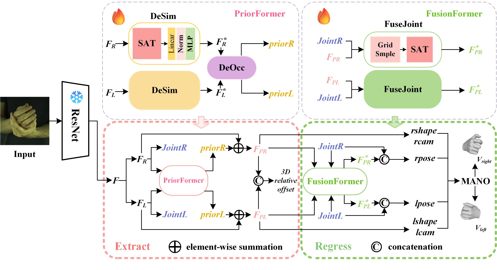

# ER 🚩
## This repository is an official implementation of the paper  "ER: Extract-Regress Network for Interacting-Hand Reconstruction from a Monocular Image".

### Abstract
Reconstructing two interacting hands from a monocular RGB image has posed a formidable challenge with two primary issues:
the interference caused by the hands' similar appearances and the lack of complete visual cues from the occlusion of hands.
To tackle these challenges, we propose the Extract-Regress Network ER, which consists of two modules: one for extracting the visual features Extract 
and another for feature fusion and regressing 3D mesh hand vertices Regress. This approach addresses the aforementioned issues
while enhancing the accuracy of hand reconstruction. 
Specifically, the Extract module comprises two sub-modules: DeSim and DeOcc. 
The DeSim sub-module is designed to decouple and capture appearance details of separate hands to address the finger-similarity issue, 
while the DeOcc sub-module aims to process latent connections and spatial cues from the interacting hands through coupled 
reasoning to solve the hand-truncated problem. Then, FuseFormer in the Regress module enhances the feature representation while 
further improving the model's performance by fusing joint position messages into visual feature maps. Considering memory-constrained devices, 
we propose more low-parameter model variants, which maintain competitive accuracy and outperform other existing methods.
Extensive experiments on publicly available benchmarks, such as InterHand2.6M, have demonstrated the effectiveness of our proposed approach.

#### Getting started 🥰 💖

- Clone this repo.
```bash
git clone https://github.com/Cantherine101424/ER
cd ER/main
```

- Install dependencies. (Python 3.8 + NVIDIA GPU + CUDA. Recommend to use Anaconda)

- Download InterHand2.6M [[HOMEPAGE](https://mks0601.github.io/InterHand2.6M/)]. 

- Download HIC [[HOMEPAGE](https://files.is.tue.mpg.de/dtzionas/Hand-Object-Capture/)] [[annotations](https://drive.google.com/file/d/1oqquzJ7DY728M8zQoCYvvuZEBh8L8zkQ/view?usp=share_link)]. You need to download 1) all `Hand-Hand Interaction` sequences (`01.zip`-`14.zip`) and 2) some of `Hand-Object Interaction` seuqneces (`15.zip`-`21.zip`) and 3) MANO fits.
#### Training
We're in the process of organizing the work and will make a full announcement when it's done.🚀🚀🚀

#### Testing
```bash
python test.py
```
